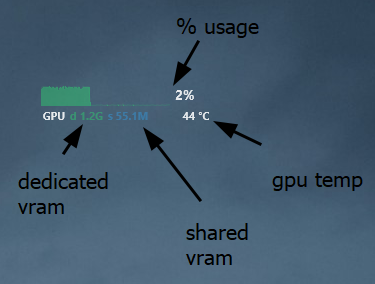

  

<h1 align="center">Dust <i>- a rainmeter skin</i></h1>

## Description

Add some skin with usefull information to your rainmeter.

### skin available

- cpu
- ram
- gpu
- network
- disk c
- disk f
- disk d

## Installation

- Dl and use the [`.rmskin`](Dust_1.rmskin) file, you can also dl it via [the github page](https://github.com/bouteillerAlan/rainmeter-clean-skin/releases)
- You need to have [SpeedFan](https://almico.com/speedfan.php) running for the CPU and GPU temp
- You need to have [CoreTemp](https://www.alcpu.com/CoreTemp/) running for the CPU frequency

## Configuration

- `@Ressources/measure` if you want to edit the code for the measure
- `@Ressources/background` if you want to edit the place that take each skin or activate a background (`SolidColor` line 16)
- `@Ressources/variables` is here to handle all the theme variable (like the color for example)
- And each other folder represent each skin
- If you want to edit the letter of a disk, you just have to edit the `DiskLabel` variable at the beginning of the disk file
- If you want to add another disk you just have to
  - copy/past an existing disk file into another folder, let's say `g`
  - rename the file to `g.ini`
  - update the `DiskLabel` variable to `G`

## Screenshot

## Code of conduct, license, authors, changelog, contributing

See the following file :
- [code of conduct](CODE_OF_CONDUCT.md)
- [license](LICENSE)
- [authors](AUTHORS)
- [contributing](CONTRIBUTING.md)
- [changelog](CHANGELOG)
- [security](SECURITY.md)

## Roadmap

- move all the plugin to `HWiNFO` - maybe very hard to configure for user :u
  - dl here https://docs.rainmeter.net/tips/hwinfo/
  - change cpu/gpu temp
  - add gpu clock
- maybe add a setting page for the color and the disk letter

## Want to participate? Have a bug or a request feature?

Do not hesitate to open a pr or an issue. I reply when I can.

## Want to support my work?

- [Give me a tips](https://ko-fi.com/a2n00)
- [Give a star on github](https://github.com/bouteillerAlan/rainmeter-clean-skin)
- Or just participate to the developement :D

### Thanks !
