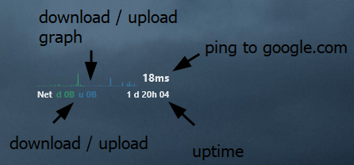

  

<h1 align="center">Dust <i>- a rainmeter skin</i></h1>

## Description

Add some skin with usefull information to your rainmeter.

### skin available

- cpu
- ram
- gpu
- network
- disk c
- disk f
- disk d

## Installation

Either use:
- HWInfo **please carefully read this list and all the link provided**
  - Dl [HWInfo](https://www.hwinfo.com/)
  - Setup [HWInfo](https://docs.rainmeter.net/tips/hwinfo/)
  - When you are in the `HWiNFO Gadget` part of the setup activate all the following metric (all this data is not necessarily used, but it is mapped in the `measure.ini` file if you want to use it.):
    - Virtual Memory Load
    - Physical Memory Used
    - Physical Memory Available
    - Physical Memory Load
    - Core Clocks
    - Core Usage
    - Core Temperatures
    - GPU Temperature
    - GPU Clock
    - GPU Core Load
    - GPU Memory Usage
    - GPU Fan1
    - GPU Fan2
    - GPU Memory Available
    - GPU Memory Allocated
  - Use `reg query HKEY_CURRENT_USER\SOFTWARE\HWiNFO64\VSB` in CMD to update the variable containt line `9` in the `measure.ini` file with the index of each measure

Or:
- [SpeedFan](https://almico.com/speedfan.php) **and** [CoreTemp](https://www.alcpu.com/CoreTemp/)

Then:
- Dl and use the [`.rmskin`](dust_1.rmskin) file, you can also dl it via [the github releases page](https://github.com/bouteillerAlan/rainmeter-clean-skin/releases)
- If you use HWInfo use the skin with the `HWI` part in the name (all skins folders without a HWI version work perfectly with or without HWI)

## Configuration

- `@Ressources/measure` if you want to edit the code for the measure
- `@Ressources/background` if you want to edit the place that take each skin or activate a background (`SolidColor` line 16)
- `@Ressources/variables` is here to handle all the theme variable (like the color for example)
- And each other folder represent each skin
- If you want to edit the letter of a disk, you just have to edit the `DiskLabel` variable at the beginning of the disk file
- If you want to add another disk you just have to
  - copy/past an existing disk file into another folder, let's say `g`
  - rename the file to `g.ini`
  - update the `DiskLabel` variable to `G`

## Screenshot 

 ### Base skin

### HWI variant (only the GPU have another data)

## Code of conduct, license, authors, changelog, contributing

See the following file :
- [code of conduct](CODE_OF_CONDUCT.md)
- [license](LICENSE)
- [authors](AUTHORS)
- [contributing](CONTRIBUTING.md)
- [changelog](CHANGELOG)
- [security](SECURITY.md)

## Roadmap

- maybe add a setting page for the color and the disk letter

## Want to participate? Have a bug or a request feature?

Do not hesitate to open a pr or an issue. I reply when I can.

## Want to support my work?

- [Give me a tips](https://ko-fi.com/a2n00)
- [Give a star on github](https://github.com/bouteillerAlan/rainmeter-clean-skin)
- Or just participate to the developement :D

### Thanks !
